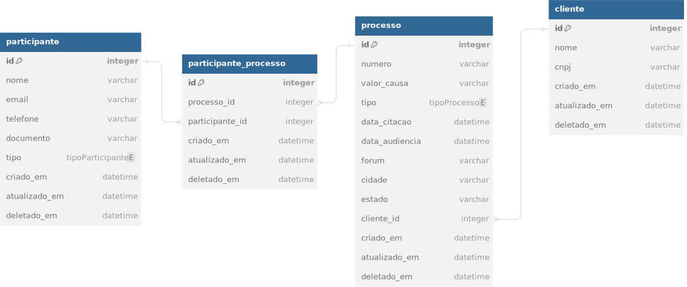

# Teste Técnico Backend Node.js - Desenvolvedor Júnior na Kor Solutions

Olá e seja bem-vindo ao teste técnico para a vaga de desenvolvedor backend junior na Kor Solutions!

Aqui na Kor, estamos comprometidos em revolucionar a indústria jurídica por meio da tecnologia. Nossa equipe está constantemente buscando inovação para simplificar e otimizar os processos legais.

## Desafio

Neste desafio, você terá a oportunidade de demonstrar suas habilidades na criação de uma API RESTful em Node.js com TypeScript. Utilizando o nosso Modelo de Entidade Relacionamento (MER) como referência, sua tarefa é implementar endpoints para gerenciar processos legais e participantes associados a eles.

Fique à vontade para utilizar os frameworks e bibliotecas que considerar mais adequados para este projeto.

Segue abaixo o MER que será utilizado para fornecer e armazenar os dados necessários:

Você pode consultar o modelo com mais detalhes [aqui](https://dbdiagram.io/d/dev-test-backend-node-jr-65e0e3cccd45b569fb3e18b4).

### Endpoints da API:

1.  Endpoints do CRUD de processo:
    
    -   `POST /processos`: Criar um novo processo
    -   `GET /processos/:id`: Obter detalhes de um processo específico
    -   `PUT /processos/:id`: Atualizar os detalhes de um processo específico
    -   `DELETE /processos/:id`: Excluir um processo específico
2.  Endpoint de listagem de processos com filtro por cliente e/ou participante:
    
    -   `GET /processos`: Listar todos os processos, com a capacidade de filtrar por cliente e/ou participante
3.  Endpoint de listagem de participantes de um processo:
    
    -   `GET /processos/:id/participantes`: Listar todos os participantes de um processo específico

## Envio do Projeto

Após finalizar a implementação, envie o link do seu repositório no GitHub para o e-mail matheus@batistela.tech, juntamente com seu nome completo.

## Dúvidas

Em caso de dúvidas durante o teste, por favor, abra uma nova issue neste repositório para que possamos ajudá-lo ;).

Boa sorte! Estamos ansiosos para ver sua implementação ;).
